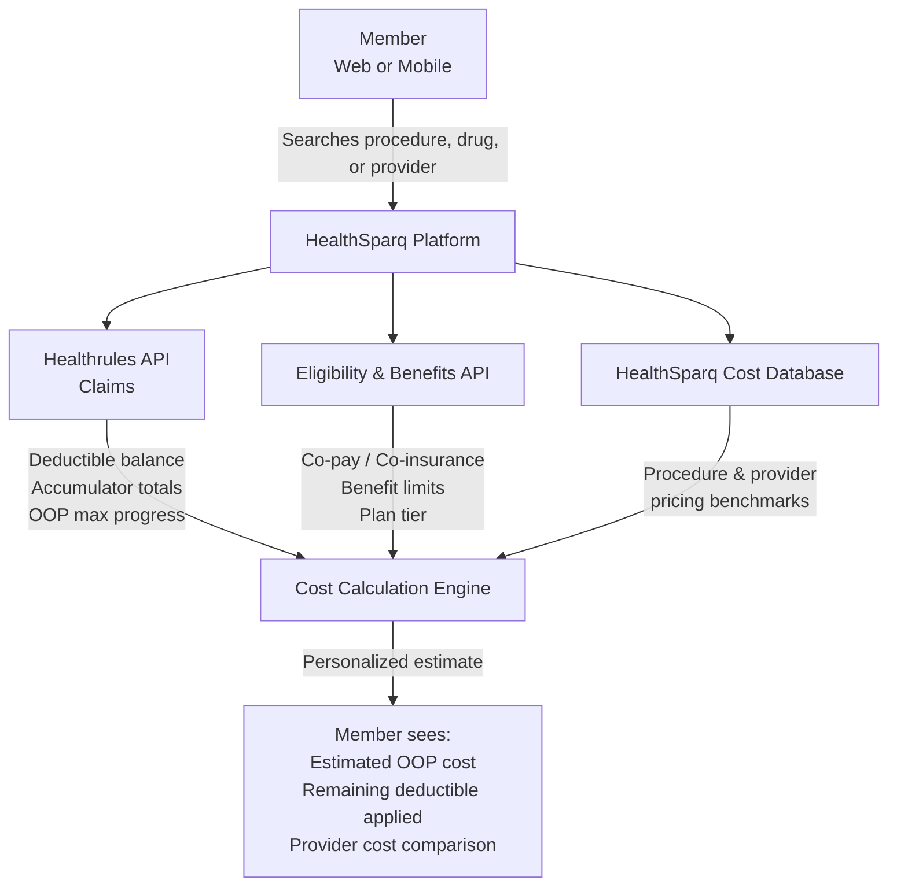
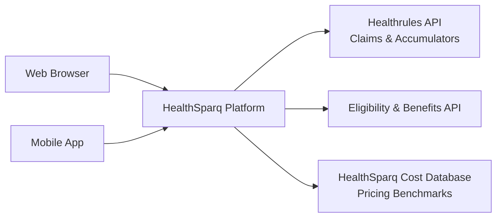
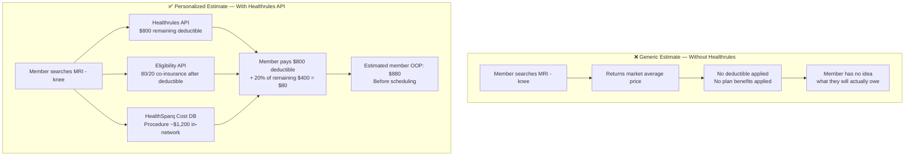

# Data Flow Diagram — HealthSparq Cost Transparency Integration

## Cost Estimate Request Flow

---

## Channel Architecture

> Single integration layer shared across web and mobile — no duplicate API connections.

---

## What Makes the Estimate Personalized

---

## Data Sources Summary

| Source | System | Data Provided |
|---|---|---|
| Claims & Accumulators | Healthrules API | Deductible balance, OOP max progress, accumulator totals |
| Benefits & Eligibility | Eligibility API | Co-pay, co-insurance, benefit limits, plan tier |
| Procedure / Provider Pricing | HealthSparq Cost Database | Market-area pricing benchmarks for procedures, drugs, providers |

---

*Diagram sanitized — internal system names, vendor identifiers, and member data removed.*
